<div align="center">


<br>


<br>


<br><br>

<table>
<tr>
<td align="center">
<b>SECURITY TELEMETRY</b><br>
<sub>Windows • Auth • Defender • USB • Network</sub>
</td>

<td align="center">
<b>DATA PLATFORM</b><br>
<sub>Airflow • PostgreSQL • dbt • Docker</sub>
</td>

<td align="center">
<b>DETECTION</b><br>
<sub>Isolation Forest • Risk Scoring</sub>
</td>

<td align="center">
<b>DECISION LAYER</b><br>
<sub>Power BI • SOC • Executive BI</sub>
</td>
</tr>
</table>

</div>

<br>

<!-- ====================================================== -->
<!-- MISSION CONTROL                                        -->
<!-- ====================================================== -->

<div align="left">


</div>

<br>

<table>
<tr>

<td width="50%" valign="top">

<h3>The Problem</h3>

<p>
Security telemetry is naturally fragmented. Operating-system events,
authentication activity, Microsoft Defender detections, firewall traffic,
USB activity, endpoint information and network evidence are generated
independently.
</p>

<p>
Without a governed analytical layer, analysts are left with large volumes
of technical events but limited decision context.
</p>

</td>

<td width="50%" valign="top">

<h3>The Engineering Response</h3>

<p>
<b>CyberSentinel Analytics</b> transforms those fragmented signals into
a reproducible security intelligence pipeline.
</p>

<p>
Raw records are collected, validated and stored in PostgreSQL Bronze,
transformed through dbt, enriched by authentication anomaly detection,
organized into analytical marts and finally exposed through Power BI
dashboards for operational, SOC, ML and executive analysis.
</p>

</td>

</tr>
</table>

> **Engineering Objective:** Preserve traceability from the original security event to the final analytical indicator while keeping ingestion, transformation, Machine Learning and Business Intelligence independently maintainable.

<br>

<!-- ====================================================== -->
<!-- SYSTEM ARCHITECTURE                                    -->
<!-- ====================================================== -->

<div align="left">


</div>

<br>


```mermaid
flowchart LR

    subgraph S["01 · SECURITY SOURCES"]
        S1["Windows System"]
        S2["Windows Application"]
        S3["Authentication"]
        S4["Microsoft Defender"]
        S5["USB / Endpoint"]
        S6["Network / Firewall"]
        S7["Public EVTX"]
    end

    subgraph I["02 · INGESTION & CONTROL"]
        I1["Python Collectors"]
        I2["Validators"]
        I3["Metadata Enrichment"]
        I4["Quarantine / Reports"]
    end

    subgraph B["03 · POSTGRESQL BRONZE"]
        B1["Raw Security Tables"]
        B2["Collection Metadata"]
        B3["Indexes & Traceability"]
    end

    subgraph T["04 · DBT TRANSFORMATION"]
        T1["Staging / Silver"]
        T2["Intermediate"]
        T3["Warehouse Marts"]
    end

    subgraph M["05 · ML SECURITY ENGINE"]
        M1["Authentication Features"]
        M2["RobustScaler"]
        M3["Isolation Forest"]
        M4["Security Risk Engine"]
    end

    subgraph P["06 · SERVING & BI"]
        P1["Power BI Models"]
        P2["SOC Dashboards"]
        P3["ML Alert Analytics"]
        P4["Executive Overview"]
    end

    S --> I --> B --> T
    T --> M
    T --> P
    M --> P

    A["Apache Airflow · Daily 02:00"] -. orchestrates .-> I
    A -. orchestrates .-> B
    A -. orchestrates .-> T
    A -. orchestrates .-> M
```

<br>

### Architecture Contract

| Zone | What enters | Engineering responsibility | What leaves |
| :--- | :--- | :--- | :--- |
| **Sources** | Host & security telemetry | Preserve original evidence and source identity | Collectable security records |
| **Ingestion** | Local raw files | Validation, metadata, controlled loading | Trusted Bronze inputs |
| **Bronze** | Validated raw events | PostgreSQL persistence, audit and indexing | Traceable raw analytical data |
| **dbt** | Bronze tables | Cleaning → standardization → analytical modeling | Silver, Intermediate & Warehouse models |
| **ML** | Authentication behavior features | Anomaly detection + security interpretation | Scores, labels, reasons and actions |
| **Power BI** | Warehouse & ML models | Operational, SOC and executive decision support | Security intelligence |

<br>

<!-- ====================================================== -->
<!-- UML USE CASE                                           -->
<!-- ====================================================== -->

<div align="left">


</div>

<br>

<p align="center">
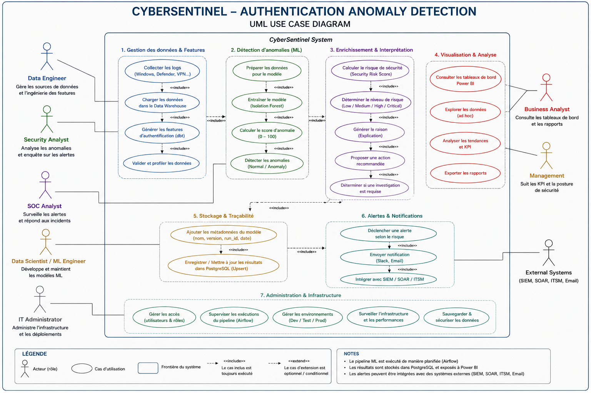
</p>

<p align="center">
<sub>
CyberSentinel use cases connect data engineering, security analysis,
Machine Learning, infrastructure administration and decision-support
workflows inside one governed security analytics platform.
</sub>
</p>

<br>

The use-case model separates the responsibilities of the platform's main actors:

| Actor | Main interaction with CyberSentinel |
| :--- | :--- |
| **Data Engineer** | Collect, validate, transform and prepare security data |
| **Security Analyst** | Analyze suspicious activity and security indicators |
| **SOC Analyst** | Investigate prioritized anomalies and incidents |
| **Data Scientist / ML Engineer** | Develop and operate anomaly-detection models |
| **IT Administrator** | Maintain runtime, access and infrastructure |
| **Business / BI Analyst** | Explore dashboards and analytical indicators |
| **Management** | Monitor security posture and executive KPIs |

The diagram highlights an important architectural principle:

> **CyberSentinel does not stop at anomaly detection. Detection is connected to interpretation, prioritization, investigation and decision support.**

<br>

<!-- ====================================================== -->
<!-- AIRFLOW                                                -->
<!-- ====================================================== -->

<div align="left">


</div>

<br>

The repository defines the Airflow DAG:

```text
cybersentinel_security_pipeline
```

The pipeline is configured for:

```text
Schedule           : 02:00 every day
Retries            : 2
Retry delay        : 2 minutes
Catchup            : disabled
Maximum active run : 1
```

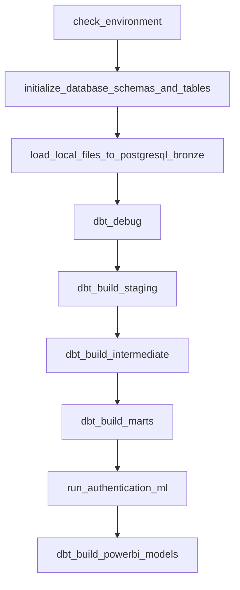
```mermaid
flowchart TD

    A["check_environment"]
    B["initialize_database_schemas_and_tables"]
    C["load_local_files_to_postgresql_bronze"]
    D["dbt_debug"]
    E["dbt_build_staging"]
    F["dbt_build_intermediate"]
    G["dbt_build_marts"]
    H["run_authentication_ml"]
    I["dbt_build_powerbi_models"]

    A --> B --> C --> D --> E --> F --> G --> H --> I
```

> **Execution Contract:** Machine Learning never scores raw collector data directly. Authentication features are produced by dbt first, and Power BI serving models are rebuilt only after the warehouse and ML stages complete.

<br>

<!-- ====================================================== -->
<!-- DATA MODELING                                          -->
<!-- ====================================================== -->

<div align="left">


</div>

<br>

CyberSentinel follows a layered analytical architecture:

```text
BRONZE
Raw source-shaped security records
        │
        ▼
SILVER / STAGING
Cleaned · Typed · Standardized · Deduplicated
        │
        ▼
INTERMEDIATE
Unified · Correlated · Enriched
        │
        ▼
WAREHOUSE / MARTS
Facts · Dimensions · ML Features · BI Models
```

| dbt Layer | Design role |
| :--- | :--- |
| **Staging / Silver** | Normalize source-specific structures, types and security values |
| **Intermediate** | Build reusable unions, correlations and enrichment models |
| **Warehouse / Marts** | Build facts, dimensions and analytics-ready datasets |
| **ML Feature Mart** | Produce authentication behavior windows for Isolation Forest |
| **Power BI Serving** | Publish stable report-facing models |

Power BI therefore does not need to understand raw EVTX-style structures or reproduce transformation logic.

The semantic and data-quality responsibility remains inside the data platform.

<br>

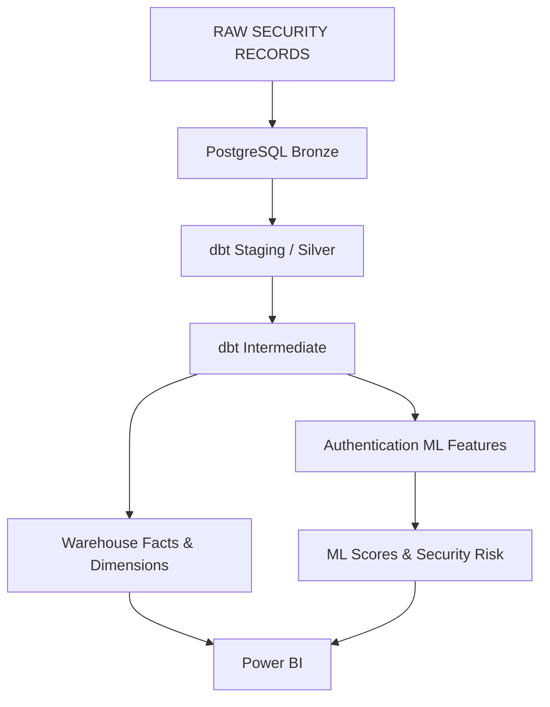
```mermaid
flowchart TD

    RAW["RAW SECURITY RECORDS"]
    B["PostgreSQL Bronze"]
    S["dbt Staging / Silver"]
    I["dbt Intermediate"]
    W["Warehouse Facts & Dimensions"]
    F["Authentication ML Features"]
    ML["ML Scores & Security Risk"]
    PBI["Power BI"]

    RAW --> B --> S --> I
    I --> W --> PBI
    I --> F --> ML --> PBI
```

<br>

<!-- ====================================================== -->
<!-- STAR SCHEMA                                            -->
<!-- ====================================================== -->

<div align="left">


</div>

<br>

<p align="center">
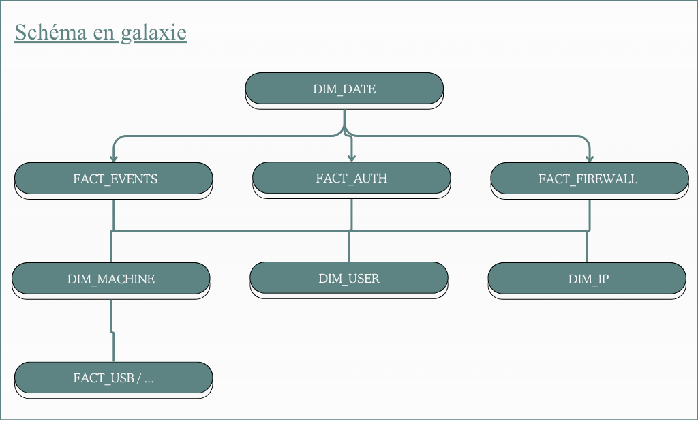
</p>

<p align="center">
<sub>
The analytical model separates measurable security events from reusable
descriptive dimensions, enabling consistent filtering and KPI calculation.
</sub>
</p>

<br>

The central security fact model can be analyzed through reusable dimensions such as:

```text
DIM_DATE
DIM_TIME
DIM_MACHINE
DIM_USER
DIM_IP
DIM_PROVIDER
DIM_EVENT_TYPE
DIM_SEVERITY
DIM_COLLECTION
DIM_THREAT
DIM_USB_DEVICE
```

At the analytical level, this produces structures conceptually similar to:

```text
                      DIM_DATE
                         │
                         │
DIM_USER ────── FACT_SECURITY_EVENT ────── DIM_MACHINE
                         │
                         │
          DIM_IP ────────┼──────── DIM_SEVERITY
                         │
                         │
      DIM_PROVIDER ──────┼──────── DIM_EVENT_TYPE
                         │
                         │
                      DIM_TIME
```

The model enables reusable semantic indicators such as:

```text
Total Events
Critical Events
Failed Logins
Threats Detected
Anomaly Rate
Security Risk Score
Machine Risk
Event Severity
```

<br>

<!-- ====================================================== -->
<!-- DATA CATALOG                                           -->
<!-- ====================================================== -->

<div align="left">


</div>

<br>

CyberSentinel includes lightweight technical catalogs alongside the main engineering components.

Each `catalog.txt` documents:

```text
01 · Files and folders
02 · Responsibility of each component
03 · Main functions / macros
04 · Technologies
05 · Engineering techniques
```

This creates a repository-level documentation layer that complements dbt documentation and the main README.

### Catalog Coverage

| Area | Catalog responsibility |
| :--- | :--- |
| **Airflow** | DAG structure, tasks, operators, scheduling and dependencies |
| **Docker / Airflow** | Runtime image, dependencies and container configuration |
| **Scripts** | Pipeline entry scripts and execution functions |
| **Ingestion** | Configuration, validation, metadata and PostgreSQL loading |
| **SQL** | Schemas, Bronze tables, indexes and ML persistence structures |
| **dbt Macros** | Reusable cleaning, normalization and key-generation macros |
| **dbt Staging** | Sources, Silver transformations and dbt quality tests |
| **dbt Marts** | Dimensions, facts, ML feature models and Power BI serving models |
| **Authentication ML** | Configuration, preparation, model, risk engine, persistence and reporting |

The catalog documentation follows the same lineage as the platform:

```text
Collector
   ↓
Ingestion Catalog
   ↓
SQL / Bronze Catalog
   ↓
dbt Staging Catalog
   ↓
dbt Marts Catalog
   ↓
ML Model Catalog
   ↓
Power BI / Analytics
```

### Example Catalog Entry

```text
repository.py
= Reads authentication features and persists ML results in PostgreSQL.

read_authentication_features()
= Reads the dbt authentication feature dataset.

_normalize_records()
= Converts pandas results into SQLAlchemy-ready records.

upsert_authentication_scores()
= Inserts new ML scores or updates existing authentication windows.

Techniques:
- Repository Pattern
- SQLAlchemy Reflection
- Batch Processing
- PostgreSQL UPSERT
- Transaction Management
```

The goal is to make the repository understandable not only at architecture level, but also at **folder, file, function and technique level**.

<br>

<!-- ====================================================== -->
<!-- AUTH ML                                                -->
<!-- ====================================================== -->

<div align="left">


</div>

<br>

<table>

<tr>

<td width="33%" valign="top">

<h3>01 · Feature Layer</h3>

<p>
Authentication activity is aggregated into machine-user behavioral windows.
</p>

<ul>
<li><code>hour</code></li>
<li><code>failed_login_count</code></li>
<li><code>successful_login_count</code></li>
<li><code>total_events</code></li>
<li><code>unique_source_ips</code></li>
<li><code>failed_login_ratio</code></li>
<li><code>is_night_login</code></li>
<li><code>events_per_minute</code></li>
</ul>

</td>

<td width="33%" valign="top">

<h3>02 · Detection Layer</h3>

<p>The model uses:</p>

<ul>
<li><b>RobustScaler</b> → scales features while reducing sensitivity to extreme ranges</li>
<li><b>Isolation Forest</b> → identifies uncommon authentication behavior without requiring attack labels</li>
</ul>

<p>
The current configuration uses <b>300 estimators</b>,
a configurable contamination rate with a default of <b>0.03</b>,
and a fixed random state for reproducibility.
</p>

</td>

<td width="33%" valign="top">

<h3>03 · Security Layer</h3>

<p>
An anomaly prediction is not considered a confirmed attack.
The security risk engine adds operational context:
</p>

<ul>
<li>ML anomaly score</li>
<li>Security risk score</li>
<li>Risk level</li>
<li>Investigation flag</li>
<li>Explainable reason</li>
<li>Recommended action</li>
</ul>

</td>

</tr>
</table>

<br>

### Machine Learning Execution Flow


```mermaid
flowchart LR

    A["dbt Authentication Features"]
    B["Data Validation"]
    C["RobustScaler"]
    D["Isolation Forest"]
    E["Anomaly Prediction"]
    F["ML Score 0–100"]
    G["Security Risk Engine"]
    H["Risk Level"]
    I["Reason & Action"]
    J["PostgreSQL ML Results"]

    A --> B --> C --> D --> E --> F --> G --> H --> I --> J
```

<br>

### Scoring Contract

```text
Behavioural rarity

Normal
0 ───────────────────────────── 69.99

Anomaly
70.00 ───────────────────────── 100
```

`ml_anomaly_score` represents **behavioral rarity**, not the probability of an attack.

The security interpretation is calculated separately:

```text
ml_anomaly_score
        │
        └── How unusual is the behaviour?

security_risk_score
        │
        └── How important is it from a security perspective?

requires_investigation
        │
        └── Should the analyst prioritize investigation?
```

### Security Risk Classification

| Score | Risk level |
| :---: | :--- |
| `0 – 29` | Low |
| `30 – 59` | Medium |
| `60 – 79` | High |
| `80 – 100` | Critical |

Each scored row is enriched with:

```text
model_name
model_version
model_run_id
scored_at
reason
recommended_action
```

This preserves traceability between the analytical result and the model execution that produced it.

<br>

<!-- ====================================================== -->
<!-- POWER BI                                               -->
<!-- ====================================================== -->

<div align="left">


</div>

<br>

<p align="center">
The reporting layer follows the same visual system as the platform:
<b>deep navy surfaces, teal/cyan security accents, compact KPI cards,
analyst-oriented navigation and progressive drill-down from executive
security posture to event-level investigation.</b>
</p>

<br>

### 01 / Global Security Overview

<p align="center">
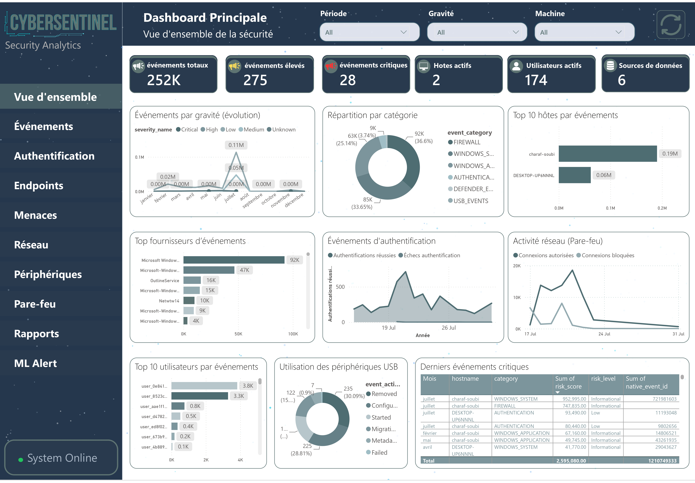
</p>

<p align="center">
<sub>
Environment-wide security posture, severity, authentication activity,
active hosts, users and recent critical signals.
</sub>
</p>

### 02 / Event Intelligence

<p align="center">
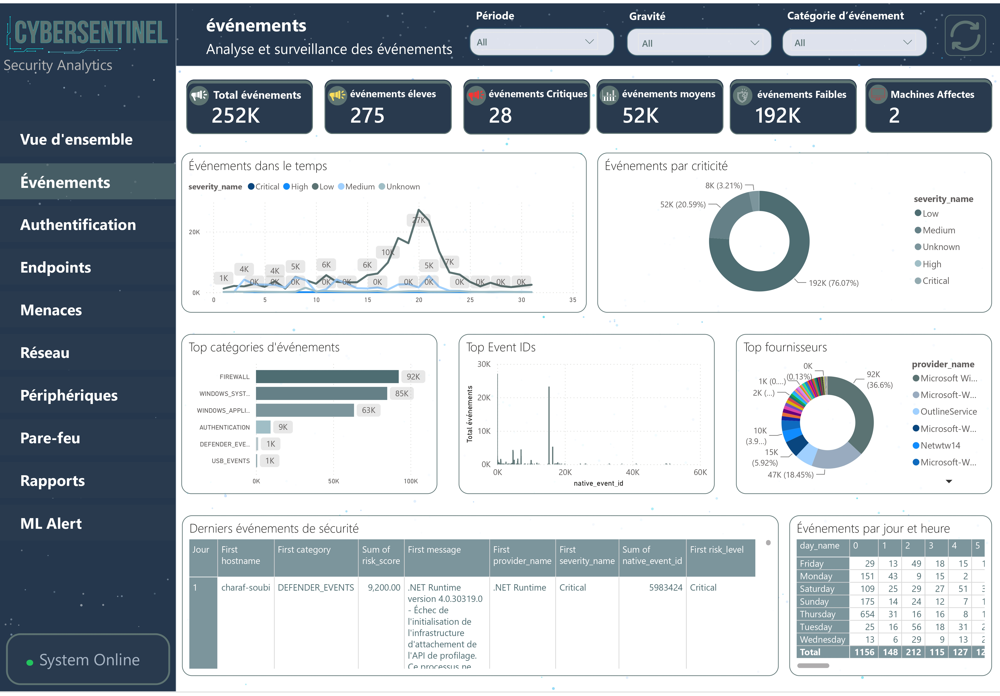
</p>

<p align="center">
<sub>
Security event volume, severity, providers, event identifiers and
detailed security-event exploration.
</sub>
</p>

### 03 / Authentication Intelligence

<p align="center">
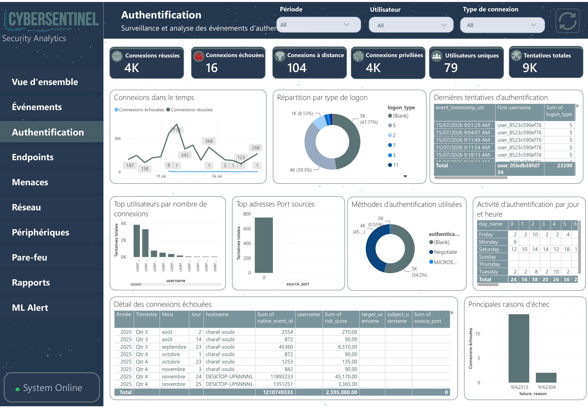
</p>

<p align="center">
<sub>
Successful and failed logons, users, source behavior,
authentication methods and temporal patterns.
</sub>
</p>

### 04 / Endpoint Intelligence

<p align="center">
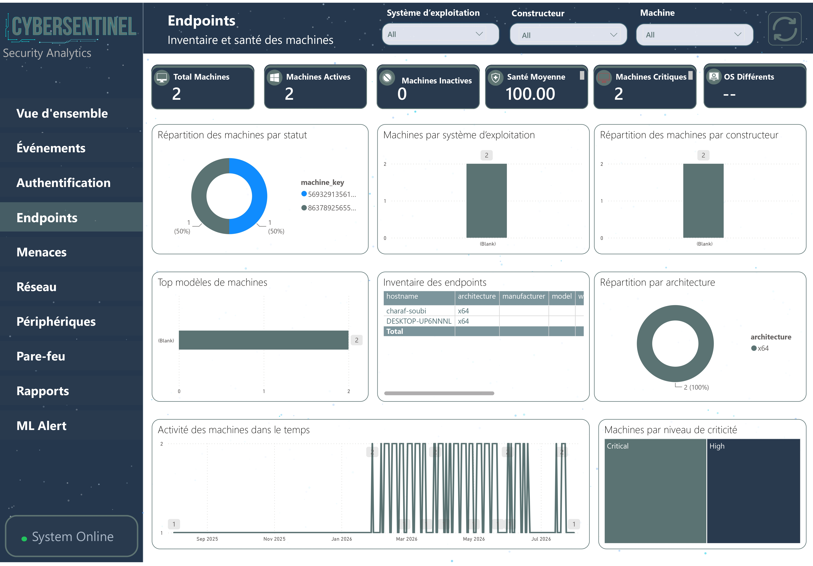
</p>

<p align="center">
<sub>
Endpoint inventory and machine visibility including activity,
architecture and endpoint context.
</sub>
</p>

### 05 / SOC Security Monitoring

<p align="center">
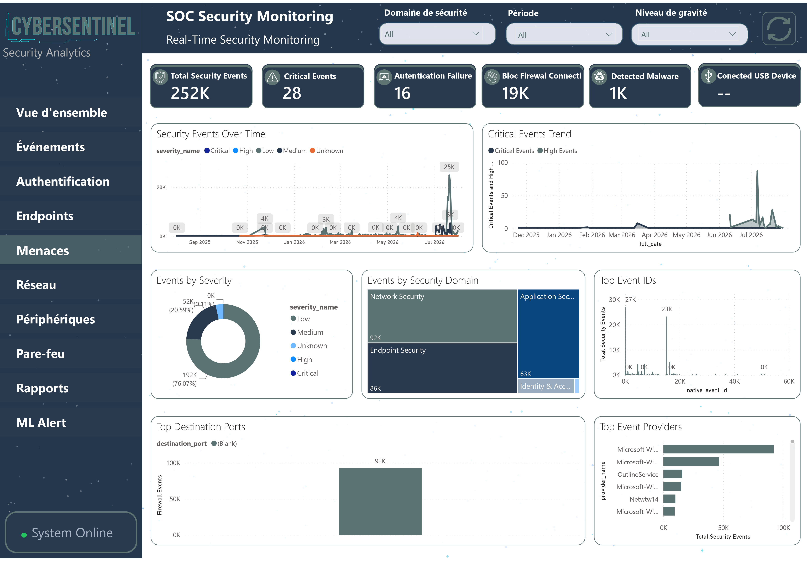
</p>

<p align="center">
<sub>
SOC-oriented monitoring across security domains, severity,
event providers, ports and critical-event trends.
</sub>
</p>

### 06 / Network Intelligence

<p align="center">
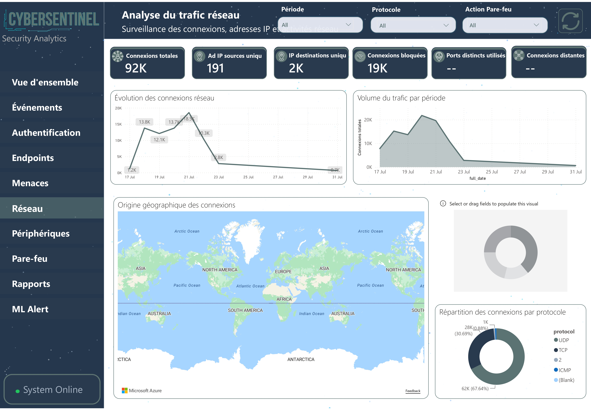
</p>

<p align="center">
<sub>
Network connections, source and destination behavior,
protocols, destination ports and traffic evolution.
</sub>
</p>

### 07 / Data Quality & Pipeline Monitoring

<p align="center">
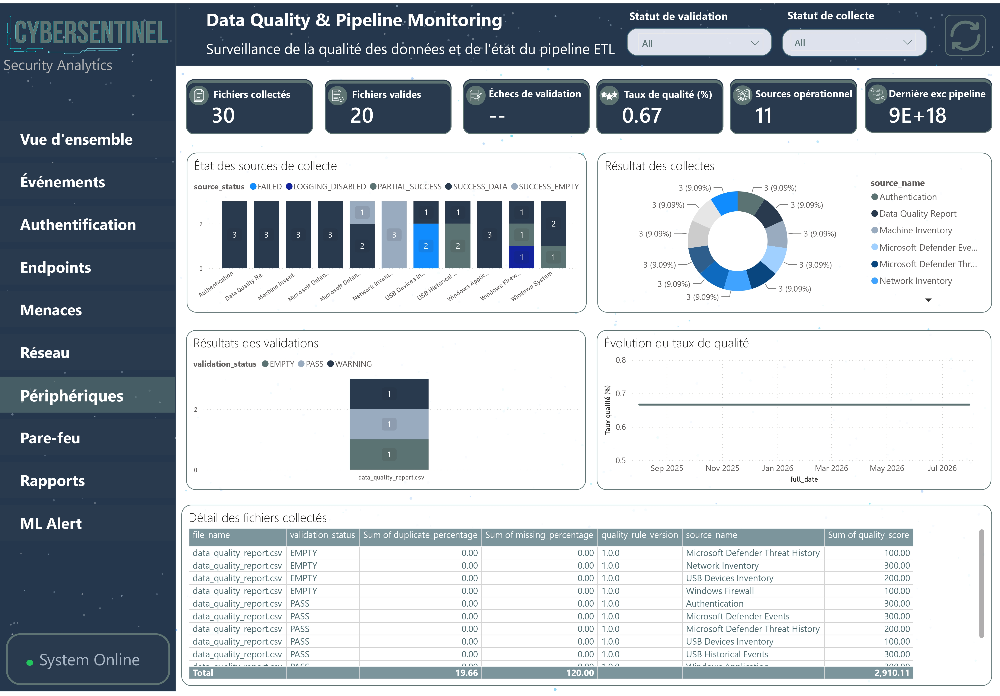
</p>

<p align="center">
<sub>
Collection status, file validation, source availability,
pipeline quality and data-quality evolution.
</sub>
</p>

### 08 / Executive Security Overview

<p align="center">
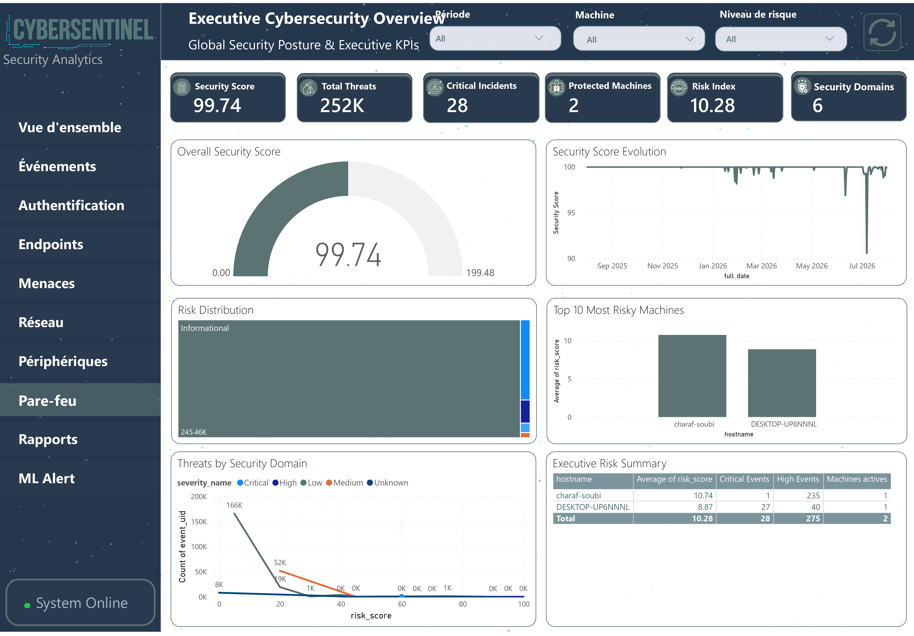
</p>

<p align="center">
<sub>
Management-level security posture including security score,
critical activity, monitored machines and risk exposure.
</sub>
</p>

### 09 / Security Reporting

<p align="center">
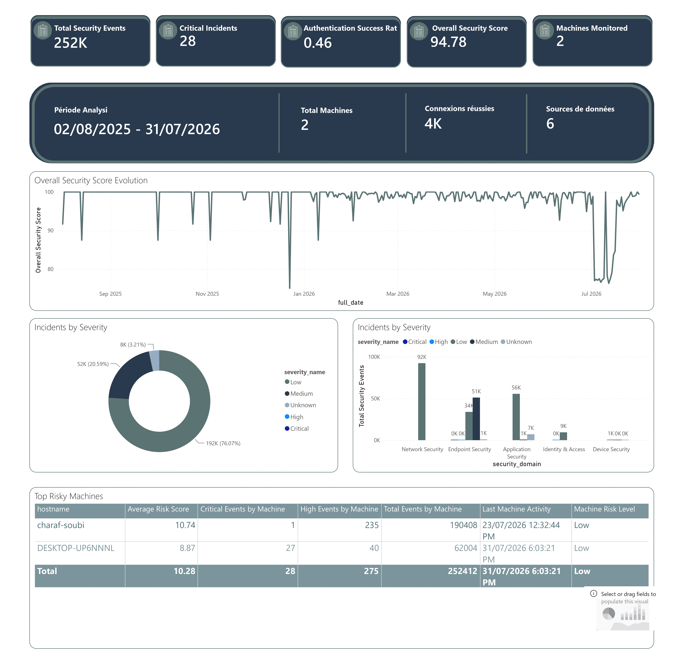
</p>

<p align="center">
<sub>
Reporting-period consolidation of security indicators,
risk trends, severity distribution and machine-level context.
</sub>
</p>

### 10 / ML Alert Intelligence

<p align="center">
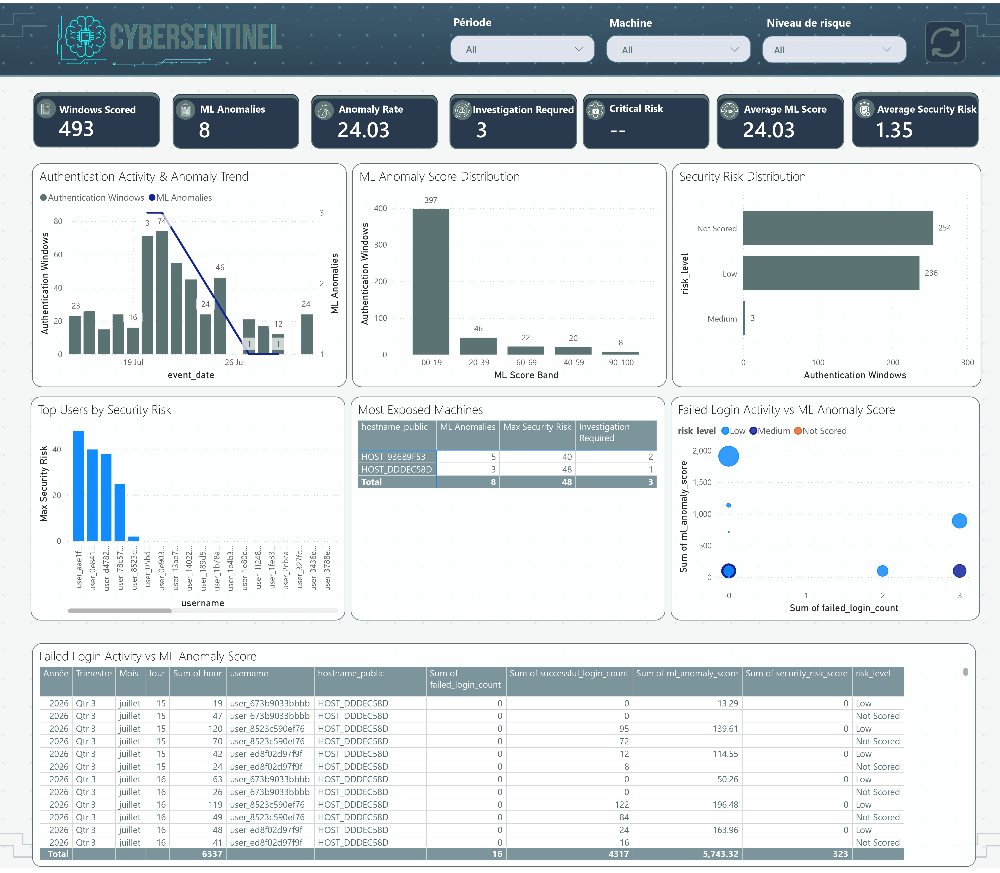
</p>

<p align="center">
<sub>
Authentication anomaly investigation combining behavioral rarity,
security risk, exposed users, machines and investigation context.
</sub>
</p>

<br>

<!-- ====================================================== -->
<!-- ENGINEERING PRINCIPLES                                 -->
<!-- ====================================================== -->

<div align="left">


</div>

<br>

<table>

<tr>
<td align="center">
<b>TRACEABILITY</b><br>
<sub>Source → Bronze → dbt → mart → model → dashboard</sub>
</td>

<td align="center">
<b>SEPARATION OF CONCERNS</b><br>
<sub>Collection, persistence, transformation, ML and BI remain modular</sub>
</td>
</tr>

<tr>
<td align="center">
<b>REPRODUCIBILITY</b><br>
<sub>Docker Compose + SQL initialization + Airflow orchestration</sub>
</td>

<td align="center">
<b>DECISION CONTEXT</b><br>
<sub>ML output is enriched with risk, explanation and recommended action</sub>
</td>
</tr>

<tr>
<td align="center">
<b>DATA QUALITY</b><br>
<sub>Validation is integrated throughout ingestion and dbt modeling</sub>
</td>

<td align="center">
<b>BI-READY MODELING</b><br>
<sub>Power BI consumes analytical models instead of raw security telemetry</sub>
</td>
</tr>

<tr>
<td align="center">
<b>DOCUMENTATION</b><br>
<sub>README + dbt metadata + folder-level technical catalogs</sub>
</td>

<td align="center">
<b>FAIL FAST</b><br>
<sub>Configuration and schema validation occur before critical operations</sub>
</td>
</tr>

</table>

<br>

<!-- ====================================================== -->
<!-- RUNTIME                                                -->
<!-- ====================================================== -->

<div align="left">


</div>

<br>

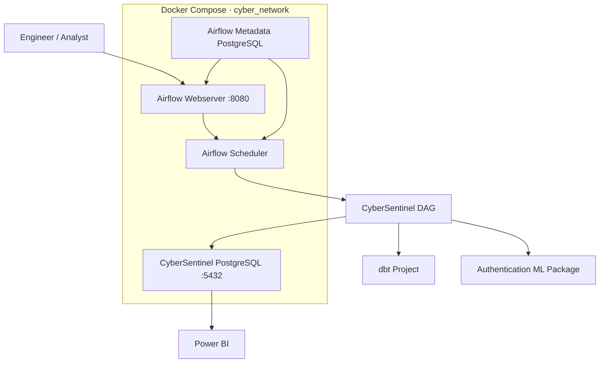
```mermaid
flowchart TB

    U["Engineer / Analyst"]
    AW["Airflow Webserver :8080"]
    AS["Airflow Scheduler"]
    DAG["CyberSentinel DAG"]
    PG["CyberSentinel PostgreSQL :5432"]
    APG["Airflow Metadata PostgreSQL"]
    DBT["dbt Project"]
    ML["Authentication ML Package"]
    PBI["Power BI"]

    U --> AW
    AW --> AS
    AS --> DAG

    DAG --> PG
    DAG --> DBT
    DAG --> ML

    APG --> AW
    APG --> AS

    PG --> PBI

    subgraph Docker["Docker Compose · cyber_network"]
        AW
        AS
        APG
        PG
    end
```

The Docker Compose runtime separates:

```text
CyberSentinel PostgreSQL
= security analytics database

Airflow PostgreSQL
= Airflow metadata database
```

The Airflow scheduler has access to the project files required to execute:

```text
SQL initialization
Python ingestion
dbt transformations
Authentication ML
Power BI serving models
```

<br>

<!-- ====================================================== -->
<!-- TECHNOLOGY MAP                                         -->
<!-- ====================================================== -->

<div align="left">


</div>

<br>

| Domain | Technology | Responsibility |
| :--- | :--- | :--- |
| **Collection & Engineering** | Python | Security collection, validation, metadata and loading |
| **Orchestration** | Apache Airflow | Scheduling, dependency management and retries |
| **Persistence** | PostgreSQL | Bronze, audit, warehouse and ML persistence |
| **Transformation** | dbt + SQL | Staging, Intermediate, Facts, Dimensions and serving models |
| **Machine Learning** | scikit-learn | RobustScaler + Isolation Forest |
| **Security Interpretation** | Python Risk Engine | Risk score, level, explanation and analyst action |
| **Analytics** | Power BI | Operational, SOC, ML and executive reporting |
| **Runtime** | Docker Compose | Reproducible local service topology |
| **Versioning** | Git / GitHub | Source control and repository distribution |
| **Documentation** | README + Catalogs + dbt YAML | Architecture, technical reference and data lineage |

<br>

<!-- ====================================================== -->
<!-- REPOSITORY MAP                                         -->
<!-- ====================================================== -->

<div align="left">


</div>

<br>

```text
cybersentinel-analytics/
│
├── airflow/
│   ├── dags/
│   │   └── cybersentinel_pipeline.py
│   └── catalog.txt
│
├── collectors/
│   └── ...
│
├── cybersentinel_auth_ml/
│   ├── __init__.py
│   ├── config.py
│   ├── database.py
│   ├── data_loader.py
│   ├── feature_engineering.py
│   ├── main.py
│   ├── metadata.py
│   ├── ml_model.py
│   ├── pipeline.py
│   ├── reporting.py
│   ├── repository.py
│   ├── risk_engine.py
│   ├── requirements.txt
│   └── catalog.txt
│
├── data/
│   ├── raw/
│   │   ├── local/
│   │   └── public_evtx/
│   ├── quarantine/
│   └── reports/
│
├── data_profiling/
│
├── dbt/
│   ├── macros/
│   │   ├── clean_text.sql
│   │   ├── generate_event_uid.sql
│   │   ├── generate_schema_name.sql
│   │   ├── generate_surrogate_key.sql
│   │   ├── normalize_null.sql
│   │   └── normalize_severity.sql
│   │
│   ├── models/
│   │   ├── staging/
│   │   ├── intermediate/
│   │   └── marts/
│   │       ├── dimensions/
│   │       ├── facts/
│   │       ├── ml/
│   │       └── powerbi/
│   │
│   ├── dbt_project.yml
│   └── profiles.yml
│
├── docker/
│   └── airflow/
│       ├── Dockerfile
│       ├── requirements.txt
│       └── catalog.txt
│
├── docs/
│   └── terminal-setup.svg
│
├── ingestion/
│   ├── config.py
│   ├── metadata.py
│   ├── postgres_loader.py
│   ├── validators.py
│   └── catalog.txt
│
├── powerbi/
│   └── assets/
│       ├── logo.png
│       ├── airflow.png
│       ├── data.png
│       ├── diagram_dutilisateur.png
│       ├── model_etoil.png
│       ├── page1.jpg
│       ├── page2.jpg
│       ├── page3.jpg
│       ├── page4.jpg
│       ├── page5.jpg
│       ├── page6.jpg
│       ├── page7.jpg
│       ├── page8.jpg
│       ├── page9.jpg
│       └── page10.jpg
│
├── scripts/
│   ├── load_bronze_to_postgres.py
│   └── catalog.txt
│
├── sql/
│   ├── 02_create_schemas.sql
│   ├── 03_create_raw_tables.sql
│   ├── 04_create_bronze_indexes.sql
│   ├── 05_create_ml_schema.sql
│   ├── 06_create_ml_tables.sql
│   └── catalog.txt
│
├── tests/
│
├── .env
├── .gitignore
├── docker-compose.yml
├── LICENSE.md
├── README.md
└── requirements.txt
```

> `catalog.txt` files act as local technical references for the corresponding engineering domain. Their role is documentation only; they are not required by the runtime pipeline.

<br>

<!-- ====================================================== -->
<!-- RUN STACK                                              -->
<!-- ====================================================== -->

<div align="left">


</div>

<br>

> **Security Note:** Keep credentials outside Git. CyberSentinel uses environment variables and a local `.env`. Never publish production credentials.

<p align="center">

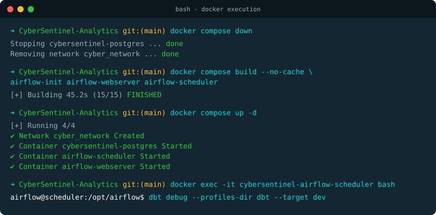

</p>

```bash
docker compose down
docker compose build --no-cache airflow-init airflow-webserver airflow-scheduler
docker compose up -d
```

Verify the running containers:

```bash
docker compose ps
```

Open an Airflow shell:

```bash
docker exec -it cybersentinel-airflow-scheduler bash
```

Validate dbt:

```bash
cd /opt/airflow/project/dbt

dbt debug \
  --profiles-dir . \
  --target dev
```

Run the authentication ML package manually if required:

```bash
cd /opt/airflow/project

python -m cybersentinel_auth_ml.main
```

The normal production flow remains orchestrated through Airflow.

<br>

<!-- ====================================================== -->
<!-- WHY                                                    -->
<!-- ====================================================== -->

<div align="left">


</div>

<br>

<div align="center">

This is not a collection of disconnected dashboards.

<br>

<b>CyberSentinel Analytics is a security data product.</b>

<br><br>

<i>
Security Telemetry
→ Data Engineering
→ Data Quality
→ Warehouse Modeling
→ Machine Learning
→ Risk Context
→ Decision Intelligence
</i>

<br><br>

The value of the project lies in the connection between those layers.

An authentication event can move from raw evidence to a validated Bronze
record, become a standardized Silver event, contribute to a behavioral
feature window, receive an Isolation Forest anomaly score, obtain a
cybersecurity risk interpretation and finally appear inside an
analyst-facing Power BI investigation workflow.

</div>

<br>

<!-- ====================================================== -->
<!-- FOOTER                                                 -->
<!-- ====================================================== -->

<div align="center">


<br><br>

<h2>CHARAF SOUBI</h2>

<p>
<b>
Data Analytics • Data Engineering • Business Intelligence • Cybersecurity Analytics
</b>
</p>

<a href="https://soubicharaf.netlify.app/">

</a>

<a href="https://github.com/charaf12-u">

</a>

<a href="https://www.linkedin.com/in/charaf-soubi/">

</a>

<a href="mailto:soubicharaf@gmail.com">

</a>

<br><br>


</div>